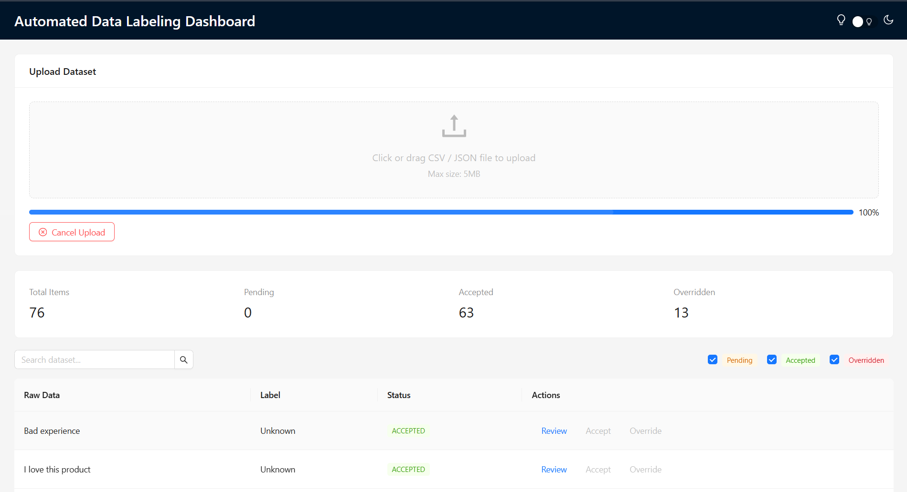
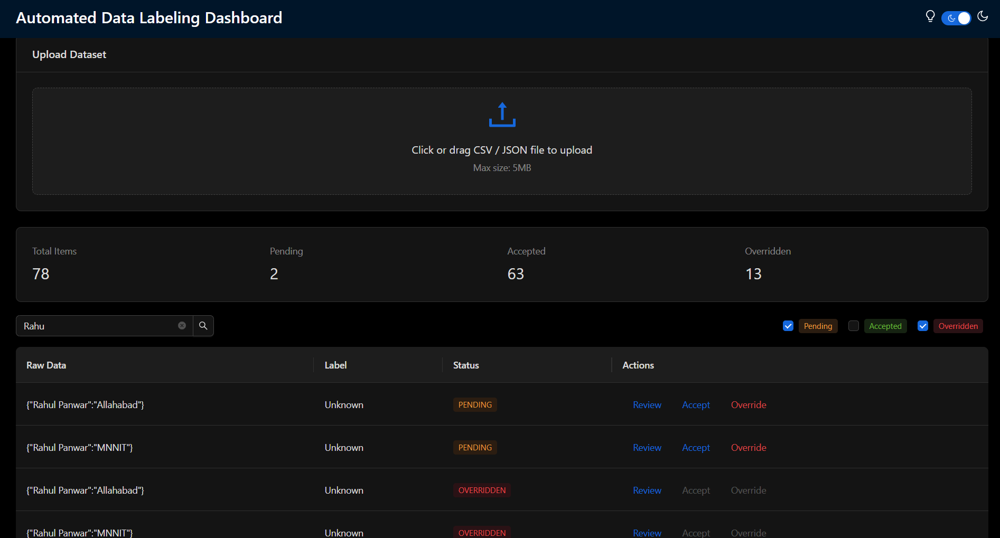
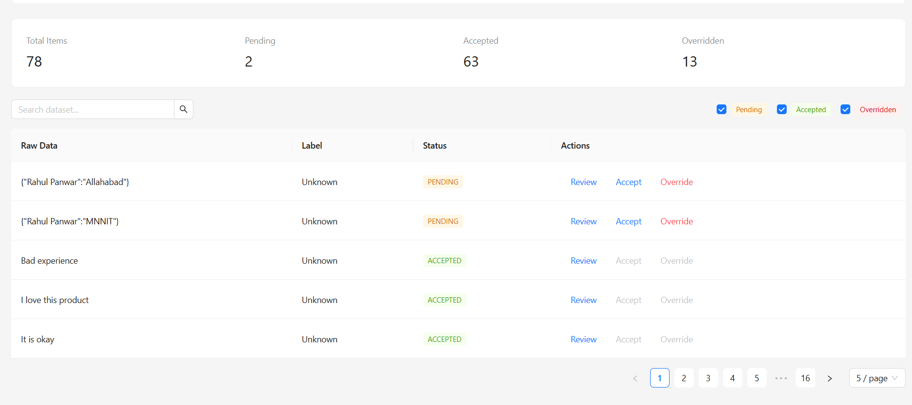

# 🚀 Automated Data Labeling Dashboard

A full-stack web application that enables **AI-assisted data labeling** with **human review**, designed as a **production-style internal dashboard**.

---

## 📌 Project Overview

Manual data labeling is slow, repetitive, and error-prone.  
This project solves that problem by combining:

- 🤖 **AI auto-labeling**
- 🧑‍⚖️ **Human-in-the-loop review**
- 🎨 **Modern interactive UI**

The result is a **scalable, user-friendly dashboard** suitable for real-world data workflows.

---

## ✨ Key Features

### 📂 Dataset Upload
- Upload **CSV / JSON** datasets
- Drag & drop support
- Client-side validation (file type & size)
- **Live upload progress bar**
- Cancel upload anytime

### 🤖 AI Auto-Labeling
- Automatic label generation using OpenAI API
- Graceful fallback when API quota is exceeded
- Safe error handling (no UI crashes)

### 🧑‍⚖️ Review & Decision Workflow
- Review raw data and AI-generated labels
- Accept correct labels
- Override incorrect labels
- Actions disabled after decision (prevents duplicates)

### 📊 Dashboard Statistics
- Total items
- Pending labels
- Accepted labels
- Overridden labels
- Auto-refresh after actions (no reload required)

### 🔍 Search & Filters
- Text search across dataset
- Filter by status:
  - Pending
  - Accepted
  - Overridden
- “All files” behavior when no filter is selected

### 🎨 UI / UX Enhancements
- Sticky top navigation bar
- Status color coding with legend
- Empty-state messaging
- Row hover animations
- Button loading states
- 🌙 Dark mode toggle (Light / Dark)

---

## 🛠️ Tech Stack

### Frontend
- **React.js**
- **Ant Design (v5)**
- Axios

### Backend
- **Node.js**
- **Express.js**
- **MongoDB**
- **Mongoose**

### AI Integration
- **OpenAI API**

---

## 📁 Project Structure

```text
automated-data-labeling-dashboard/
│
├── frontend/
│   ├── src/
│   │   ├── components/
│   │   │   ├── UploadDataset.jsx
│   │   │   ├── DataTable.jsx
│   │   │   ├── StatsBar.jsx
│   │   ├── pages/
│   │   │   └── Dashboard.jsx
│   │   ├── services/
│   │   │   └── api.js
│   │   └── App.js
│   └── package.json
│
├── backend/
│   ├── models/
│   │   └── DataItem.js
│   ├── routes/
│   │   ├── uploadRoutes.js
│   │   ├── itemRoutes.js
│   │   └── statsRoutes.js
│   ├── services/
│   │   └── openaiService.js
│   ├── app.js
│   ├── server.js
│   └── package.json
│
└── README.md


````
## ⚙️ Setup Instructions

### 1️⃣ Clone the Repository
```
https://github.com/Rahul4mnnit/Automated-Data-Labeling
cd automated-data-labeling-dashboard
```
### 2️⃣ Backend Setup
```
1. cd backend
2. npm install
```
#### Create a .env file:
```
MONGO_URI=your_mongodb_connection_string
OPENAI_API_KEY=your_openai_api_key
PORT=5000
```

#### Run backend:
```
npm run dev
```
#### Backend  runs at: 
```
http://localhost:5000
```
### 3️⃣ Frontend Setup
```
1. cd frontend
2. npm install
3. npm start

```
#### Frontend runs at:

``` http://localhost:3000 ```

### 🧪 Sample Dataset
- Example JSON
```
[
  { "text": "Great service" },
  { "text": "Very slow support" },
  { "text": "Excellent experience" }
]
```

## 📸 Screenshots (Recommended)


### Dashboard (Light Mode)


### Dashboard (Dark Mode)


### Filters & Search


## 🧠 Design Decisions

- Human-in-the-loop architecture ensures AI quality control

- Defensive programming prevents UI crashes

- Client-side filtering/search for fast UX

- Dark mode implemented using Ant Design theme algorithms

- Upload cancellation via AbortController (modern standard)

## 🚀 Future Enhancements

- Batch AI labeling

- Export labeled datasets

- Role-based access control

- Advanced analytics & charts


### 👤 Author

- Name  - Rahul Panwar
- MCA -         XI Sem
- Motilal Nehru National Institute of Technology Allahabad     
         
